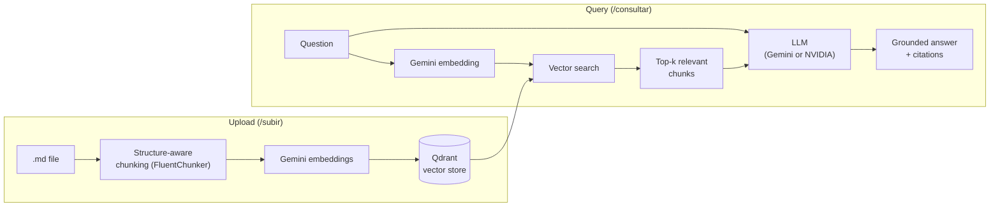

# RagTesis

A Retrieval-Augmented Generation system, built in C# / .NET, that lets you
ask natural-language questions about a long-form document (in this case,
a theology thesis) and get answers grounded in the document itself —
with exact section citations, not hallucinated ones.

Built as a hands-on project to move from React/frontend development into
applied AI engineering: designing a real RAG pipeline end to end
(chunking → embeddings → vector search → grounded generation), not just
calling a chat API.

## What it does

1. **Upload** a Markdown document through a web UI. It gets split into
   structure-aware chunks (respecting headings, tables, code blocks),
   embedded, and stored in a vector database.
2. **Ask questions** about it in plain language. The system embeds the
   question, retrieves the most relevant chunks, and asks an LLM to
   answer *using only those chunks* — citing the section each fact comes
   from, and explicitly saying so when the retrieved context isn't
   enough to answer.

Two independent vector collections are supported (`my-thesis` and
`reference-corpus`), so a user's own document is never mixed with
reference material as retrieval context.

## Architecture



The solution is split into three projects so the RAG logic is reusable
and UI-agnostic:

| Project | Role |
|---|---|
| `RagTesis.Core` | Chunking, embeddings, vector store access, LLM client factory, chat services. No UI dependency. |
| `RagTesis.Web` | Blazor Server UI (upload page, query page) consuming `RagTesis.Core`. |
| `RagTesis` | CLI tool for querying a collection directly — useful for debugging the pipeline without a browser, and for comparing LLM providers/models from the terminal. |

## Stack

- **Language**: C# / .NET 9
- **Chunking**: [FluentChunker](https://www.nuget.org/packages/FluentChunker), structure-aware via Markdig — splits by real document structure instead of naive regex, and tags each chunk with its full heading path (e.g. `Chapter 3 > 3.2 Methodology`) for precise citation.
- **Embeddings**: Google Gemini (`gemini-embedding-001`, 768 dimensions) via `Microsoft.Extensions.AI` + `Mscc.GenerativeAI.Microsoft`.
- **Vector store**: [Qdrant](https://qdrant.tech), running locally in Docker with a persistent volume.
- **Generation**: provider-agnostic via `Microsoft.Extensions.AI`'s `IChatClient` abstraction. Interchangeable between:
  - Google Gemini — multiple model tiers selectable at query time (Flash, Flash Lite, and newer Flash releases), to route around free-tier rate limits.
  - NVIDIA (Nemotron 3 Ultra 550B via NVIDIA NIM), used as a fallback provider and for quality/speed comparison.
- **Web UI**: Blazor Server (server-side interactive rendering, no separate frontend stack needed since the whole project is already C#).

## Engineering decisions worth calling out

A few choices that came from hitting a real wall, not from a tutorial:

- **Persistent vector store over in-memory**: an in-memory vector store
  doesn't survive process restarts — switched to Qdrant with a mounted
  volume early on.
- **768 embedding dimensions, not 3072**: Gemini's documentation
  suggests 3072 as the default; the actual dimensionality had to be
  confirmed empirically after Qdrant rejected the vector size. Now
  centralized in one config constant so the embedding service and the
  vector record schema can't drift out of sync.
- **Manual, LLM-assisted PDF→Markdown conversion over an automated
  pipeline**: automated extractors (Docling, Marker) failed on
  multi-column academic layouts and line-break hyphenation. Benchmarks
  showed vision-capable chat LLMs outperforming traditional OCR /
  Document Intelligence on complex layouts (~90–94% vs ~81–83% accuracy
  in the cases tested), so extraction is done by feeding pages to a
  vision-capable LLM instead. A proof-of-concept for automating this
  step exists (`ExtractorVisionService`) but isn't wired into the main
  flow yet.
- **Deliberate scope cut**: the original goal was a thesis *reviewer*
  that checked claims against a ~50-book corpus. That was dropped in
  favor of "ask questions about your own document" — digitizing 50
  books wasn't worth it when a human advisor already fills that
  verification role. The reviewer code path (`RevisorService`, claim →
  evidence → verdict) is still in the codebase as an alternate module,
  not part of the main app.
- **Timeouts and provider fallback around free-tier rate limits**: a
  real production issue — an LLM call hung indefinitely with no
  exception under load, initially suspected to be a `SynchronizationContext`
  deadlock between the Gemini SDK and Blazor Server's renderer. Diagnosed
  with the VS Code debugger and confirmed via the provider's usage
  dashboard: it was `429` rate limiting, not a concurrency bug. Fixed
  with an explicit `CancellationToken` timeout (so failures are visible
  instead of an infinite spinner) and a selectable model/provider so a
  saturated free tier doesn't block the whole app.

## Project structure

```
rag-tesis/
├── src/
│   ├── RagTesis.sln
│   ├── RagTesis.Core/       # Chunking, embeddings, vector store, chat services
│   ├── RagTesis/            # CLI query tool
│   └── RagTesis.Web/        # Blazor Server UI
├── data/pdfs/                # Source PDFs (gitignored, local only)
├── output/
│   ├── markdown/              # Converted .md documents
│   └── chunks/                 # Cached chunk JSON (debug artifact)
└── vectorstore-data/          # Qdrant's persistent volume (gitignored)
```

## Getting started

### Prerequisites

- [.NET 9 SDK](https://dotnet.microsoft.com/download)
- [Docker](https://www.docker.com/) (to run Qdrant)
- A [Gemini API key](https://aistudio.google.com/apikey) (free tier works)
- Optionally, an [NVIDIA NIM API key](https://build.nvidia.com/) as a fallback provider

### Setup

```bash
# 1. Run Qdrant
docker run -d --name qdrant -p 6333:6333 -p 6334:6334 \
  -v "$(pwd)/vectorstore-data:/qdrant/storage" qdrant/qdrant

# 2. Configure API keys (per project — RagTesis and RagTesis.Web each
#    have their own UserSecretsId, or share one manually)
cd src/RagTesis
dotnet user-secrets set "GoogleApiKey" "your-key-here"
dotnet user-secrets set "NvidiaApiKey" "your-key-here"   # optional

# 3. Build
cd ../..
dotnet build src/RagTesis.sln
```

### Run the web app

```bash
cd src/RagTesis.Web
dotnet run
```

Open `http://localhost:5062`, go to **Subir** to upload a `.md` file,
then **Consultar** to ask questions about it.

### Or query from the CLI

```bash
cd src/RagTesis
dotnet run -- "your question here"          # NVIDIA by default
dotnet run --gemini -- "your question here" # force Gemini
```

## Known limitations

- Question embedding always uses Gemini — there's no embedding
  alternative wired up yet, so if Gemini's embedding quota is exhausted,
  querying breaks even if a different provider is selected for
  generation.
- No automated retrieval/answer-quality evaluation yet (manual spot
  checks so far). A small labeled Q&A set with retrieval recall and
  answer-faithfulness scoring is a natural next step.
- PDF→Markdown conversion is still a manual step (feeding pages to a
  chat LLM), not integrated into the upload flow.
- Developed on Windows + WSL2; a couple of environment-specific
  workarounds are documented in code comments (a `.NET`
  `FileSystemWatcher` crash on UNC paths, and duplicated `user-secrets`
  storage between the Windows and WSL `dotnet` installs).

## License

MIT — see [LICENSE](LICENSE).
